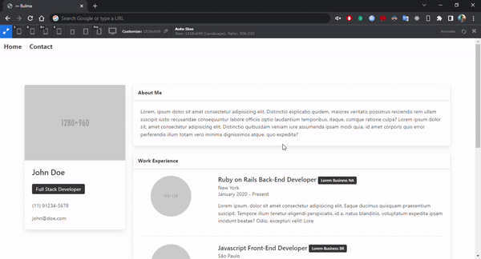
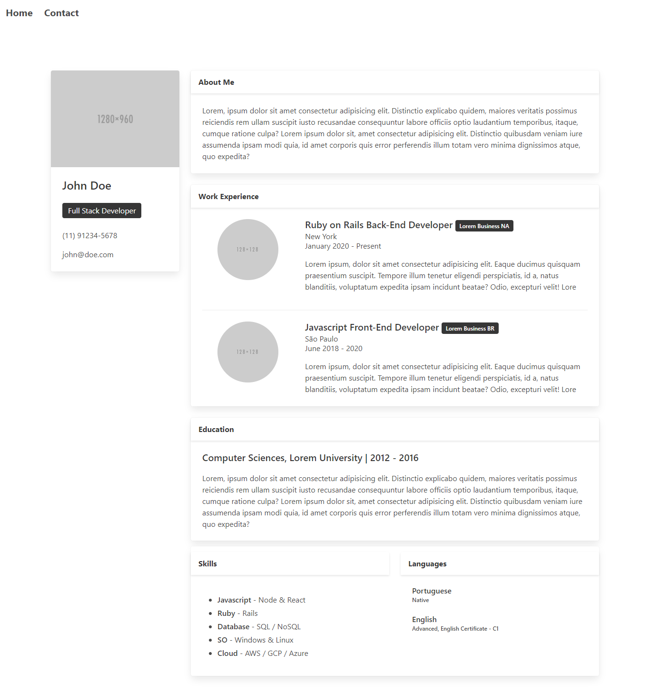
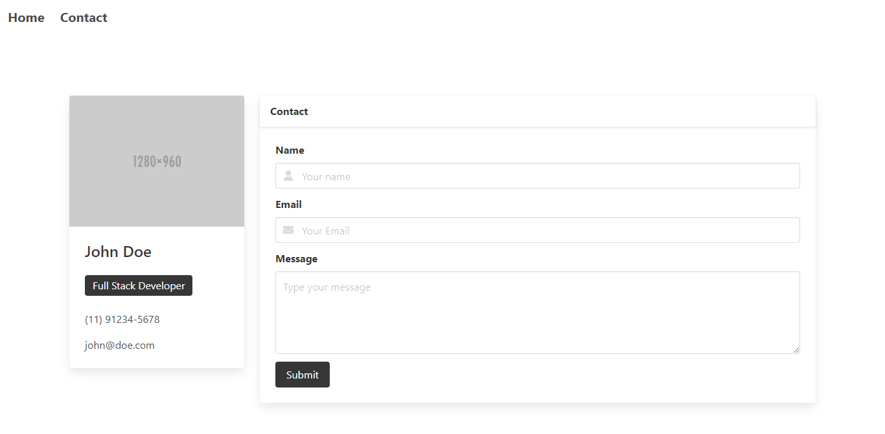
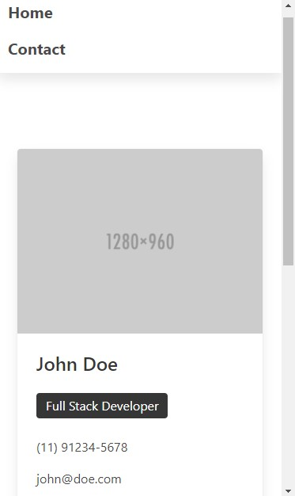
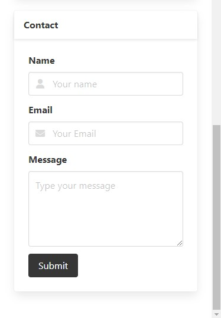

 

  

  <h3 align="center">Bulma Site</h3>
  
Esse é um modelo de site para portfólio feito utilizando somente HTML e Bulma.

 
 

<h1 align="left">🚀 Tecnologias</h1>

  
  

 
 
 
<h1 align="left">🔎 Confira</h1>

    
    
    
  
  

